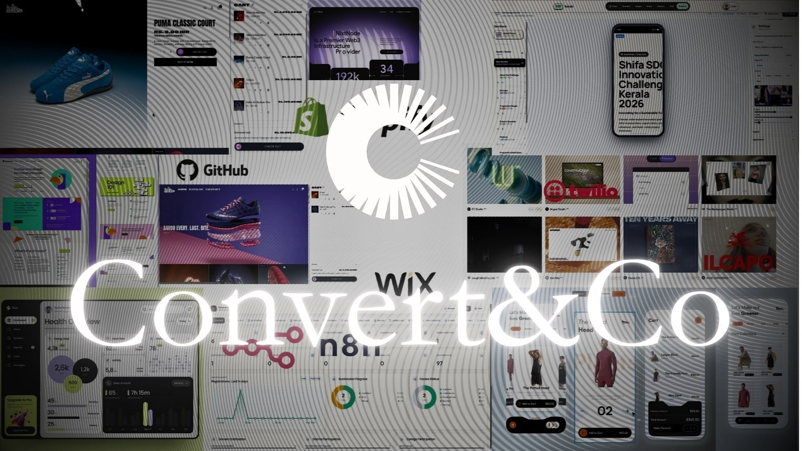

<div align="center">
  
</div>

# Creative Agency Portfolio

A responsive, motion-led agency website for Shopify development, AI automation, product advertising.
## Founder : Mohammed Febin 
## Co-Founder : Mohammed Kahab K
## Highlights

- Interactive image-trail hero
- Responsive featured-project banner
- Recent Shopify and ecommerce work showcase
- Animated partner-logo marquee
- Service, process, automation, and case-study sections
- Animated Figma-style capability graphic
- Holographic promotional ticket (display-only demo)
- Responsive contact form with direct email link
- Mobile layouts and reduced-motion support
- High qulty primum web

## Tech stack

- React 19
- TypeScript
- Vite 6
- Tailwind CSS 4
- CSS animations and responsive layouts

## Run locally

Prerequisite: Node.js 18 or newer.

```bash
npm install
npm run dev
```

The development server runs at `http://localhost:3000`.

## Validation and production build

```bash
npm run lint
npm run build
npm run preview
```

Production files are generated in `dist/`.

## Project structure

```text
src/
  components/
    PolaroidTrailHero.tsx     Interactive hero and image trail
    PostHeroSections.tsx      Portfolio, services, process, and contact
    FigmaServiceCard.tsx      Animated capability graphic
    PromoTicket.tsx           Display-only promotional ticket
imgeasset/                    Hero and campaign artwork
web_aset/                     Recent-work screenshots
logos/                        Partner-logo marquee assets
t.jpg                         Featured banner image
```

## Content and assets

- Change the featured banner in `PostHeroSections.tsx`.
- Add or update recent-work screenshots in `web_aset/`, then update the `PROJECTS` list.
- Add partner logos in `logos/`, then update the `LOGOS` list.
- Hero trail imagery is configured in `PolaroidTrailHero.tsx`.


